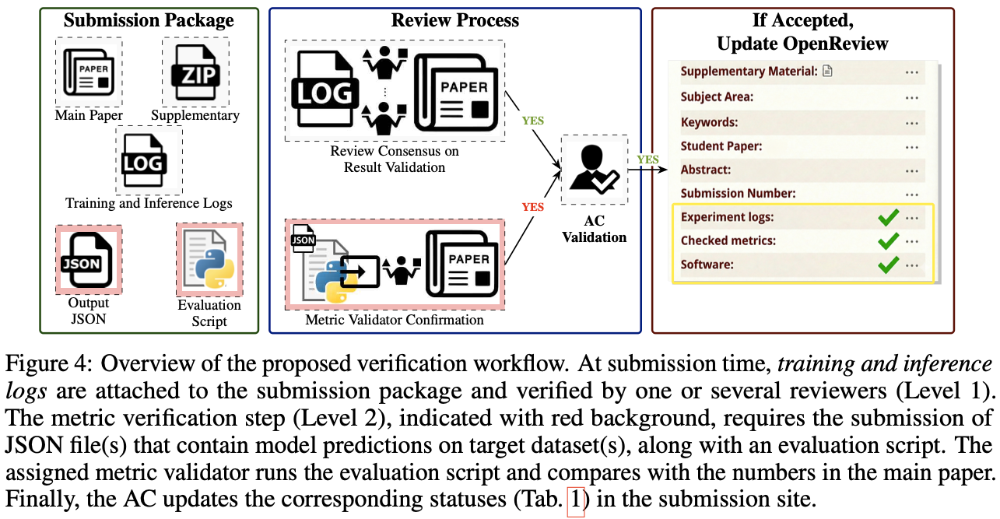

# Position: Let’s Strengthen Verifiability If We Can’t Enforce Reproducibility


<p align="center">
  <a href="PAPER_URL"></a>
  <a href="#citation"></a>
</p>

<!-- <p align="center">
  <b>Code for the reproducilibity study presented in the paper.</b>
</p> -->

<!-- Optional teaser / method figure -->
<p align="center">
  
</p>

## Abstract

In the field of Machine Learning, many papers contain empirical results supporting claimed statements or illustrating the performance of a proposed method. However, most practitioners know that (1) results are generally hard to reproduce, and increasingly so, (2) code is not often available to do so, and (3) it hinders the development of research. In this position paper, we analyze and quantify these issues, and make concrete proposals to improve result checkability, if not reproducibility. 

## Install 

Setup the environment:

```
conda create -n lmdeploy python=3.10
conda activate lmdeploy
pip install torch==2.7.1 torchvision==0.22.1 torchaudio==2.7.1 --index-url https://download.pytorch.org/whl/cu128
pip install -r requirements.txt
```


## 1. Download PDFs of Accepted Papers from Conference Websites

To download the papers for all conferences. 
You can adjust below params:

```bash
python download_pdfs_all_with_cvf_supp.py --out-dir ./all_pdfs --start-year 2021 --end-year 2025 --venues "CVPR,ICCV,ICML,ICLR,NeurIPS" --skip-existing
```


## 2. Extract all the URLs from each paper and determine the best candidate to be the code/implementation link.

Here we use an LLM to reason. We are using [lmdeploy](https://github.com/InternLM/lmdeploy) to create the pipeline.
You can select from available LLMs. We use `internlm3` in our study. 

This code will save the json files to the --out path. No need to give the venue information again. 

```bash
VENUE=NeurIPS_2024
echo $VENUE
python extract_code_urls_from_pdf.py --pdf_dir ./all_pdfs/$VENUE  --model "internlm/internlm3-8b-instruct" --out ./url_checker
```

**Unfortunately, rarely there happens errors during the process. In some cases the LLM generated report is not parsable to a json file, especially when the reason contains non-standard charecters such as formulas etc. It may require intervention when errors happen.**

## 3. Check whether the repository of the paper contains train/inference codes and properly describes how to use the repo. Also checker whether there are open issues regarding reproduciblity.

Run below command. It will run `git fetch` for the `code_urls` extracted in the previous stage.

```bash
VENUE=NeurIPS_2024
echo $VENUE
python analyse_code_repos_with_pages.py --json_dir ./url_checker/$VENUE  --repo_dir ./repo_dump --out ./repos_checked
```

## 4. Classify topics of the papers.

Run below command to classify each paper's topic into predefined 10 categories.

```bash
VENUE=NeurIPS_2024
echo $VENUE
python classify_pdfs_by_topic.py --pdf_dir ./all_pdfs/$VENUE  --model "internlm/internlm3-8b-instruct" --out ./topic_checker
```

## 5. Mapping papers to Titles

The downloaded PDF file names are encoded using hash functions. Hence, in order to map papers to titles, we also share the titles of accepted papers for all the venues in `paper_titles` folder.  

Run below commands to map the papers with titles for each venue;

```bash

cd mapper_scripts

VENUE=CVPR_2025
echo $VENUE
python map_cvf_titles.py --conf "CVPR" --year "2025" --pdf_dir ../all_pdfs/$VENUE --out ../matched_json/$VENUE.json

VENUE=ICCV_2025
echo $VENUE
python map_cvf_titles.py --conf "ICCV" --year "2025" --pdf_dir ../all_pdfs/$VENUE --out ../matched_json/$VENUE.json

VENUE=ICLR_2025
echo $VENUE
python map_iclr_titles.py --year "2025" --pdf_dir ../all_pdfs/$VENUE --out ../matched_json/$VENUE.json

VENUE=ICML_2025
echo $VENUE
python map_icml_titles.py --year "2025" --pdf_dir ../all_pdfs/$VENUE --out ../matched_json/$VENUE.json

VENUE=NeurIPS_2025
echo $VENUE
python map_neurips_titles.py --year "2025" --pdf_dir ../all_pdfs/$VENUE --out ../matched_json/$VENUE.json
```

Need to repeat for the desired venues and years.

## 6. Get the citation counts for all the papers.

In order to get the citation numbers for the papers, first request and receive an API key from Semantic Scholar.

Then, run below command. It traverses through all the 

```bash
python get_citation_counts_title_based.py --matched_dir ./matched_json  --out ./citation_counts 
```


## 7. Merging all the extracted information 

Now we have all the relevant data for a paper, but they reside in different folders and json files. 
Using below script, you could generate a single json file with all the information.
You can edit the default paths in the script.

```bash
python json_data_merger.py
```

## 8. Statistics

In the `example_statistics` folder, we share two example scripts to extract usefull information.


## 9. Example metric notebooks

In the `metric_notebooks` folder, we share two example python notebooks for the metric validation submission.


## Citation

If you find this work useful, please cite:

```bibtex
@article{position2026hicsonmez,
  title   = {Position: Let’s Strengthen Verifiability If We Can’t Enforce Reproducibility},
  author  = {Samet Hicsonmez, Nermin Samet, Renaud Marlet},
  journal = {NeurIPS},
  year    = {2026}
}
```
